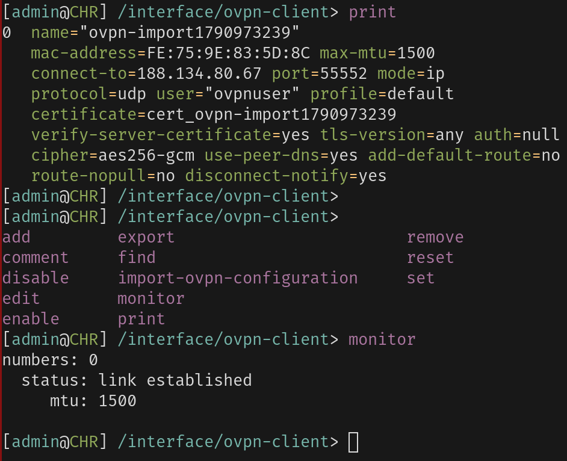
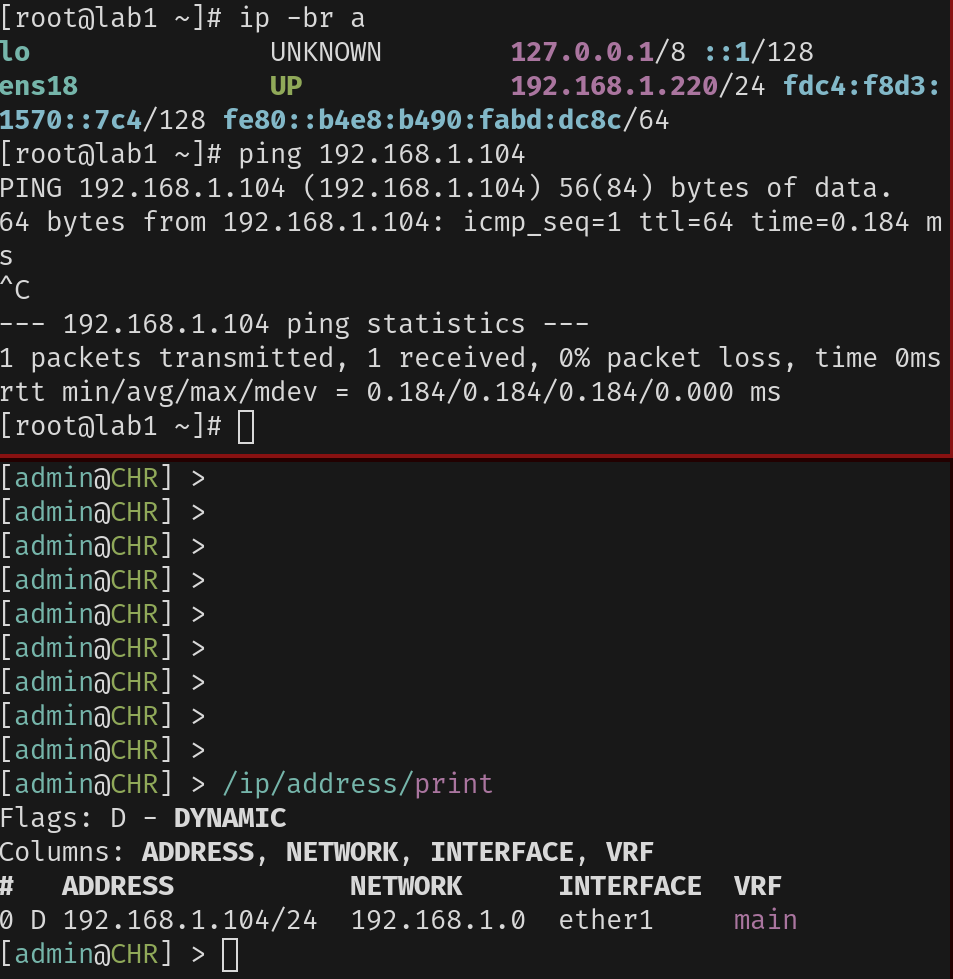
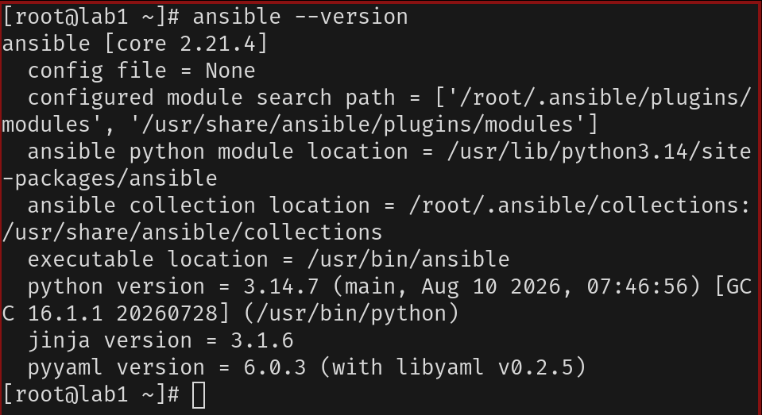

University: [ITMO University](https://itmo.ru/ru/) 
Faculty: [FICT](https://fict.itmo.ru) 
Course: [Network programming](https://github.com/itmo-ict-faculty/network-programming)  
Year: 2025/2026 
Author: Голованов Дмитрий Игоревич 
Lab: Lab1 

# Лабораторная работа №1. 

Поднимал все я на своем proxmox, open-vpn поднят на моем openwrt свиче, к которому подключен proxmox

Тут я подниму впн, но в следующих лабах оно все просто будет крутится в одной сети

Впн клиент:

Пинги:

Ансибл:

