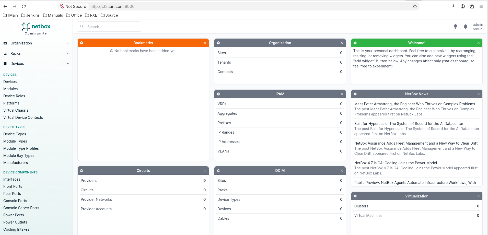
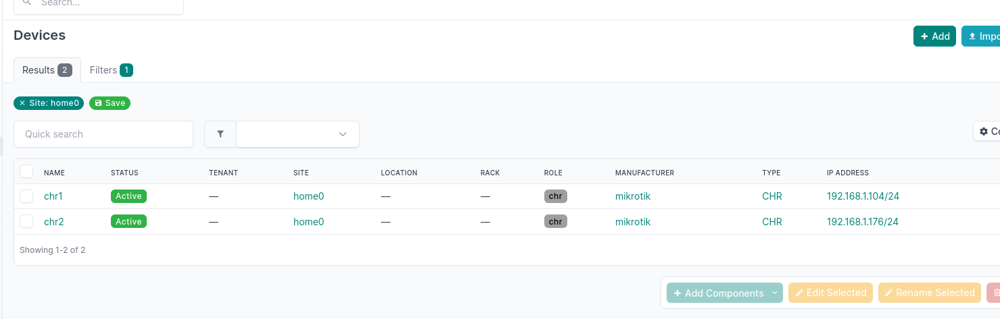
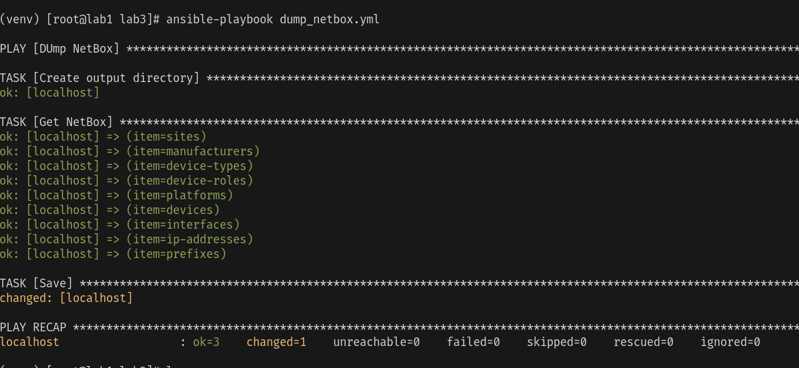
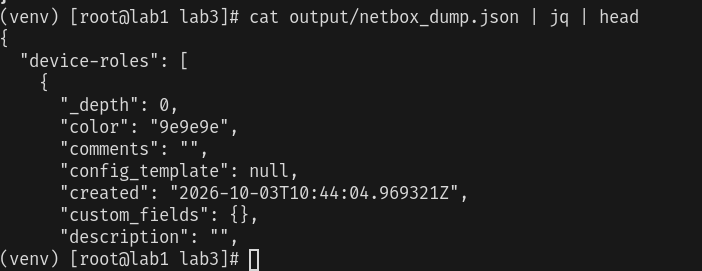
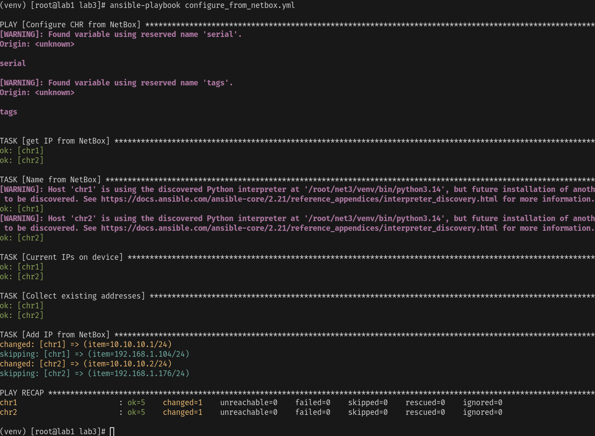
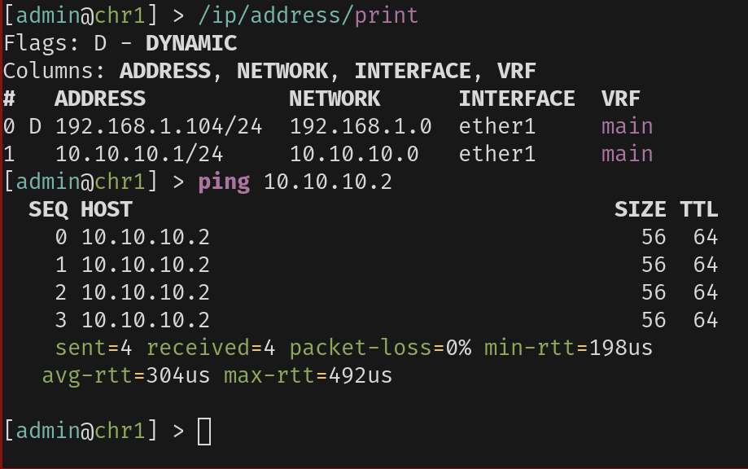
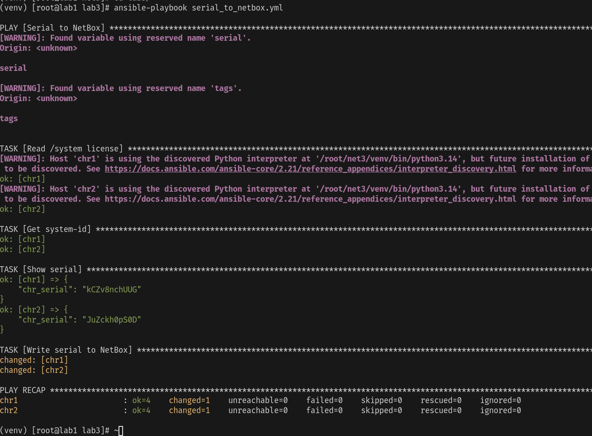
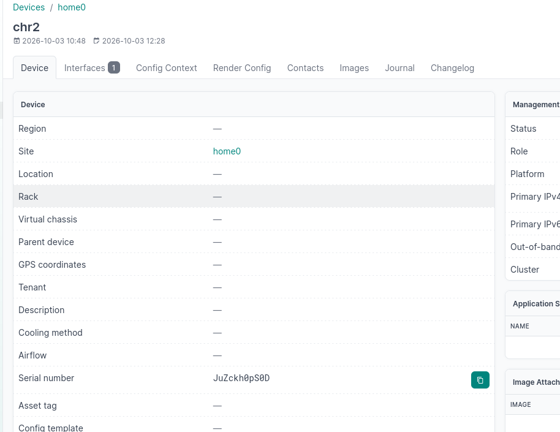
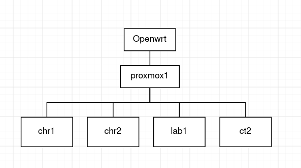

University: [ITMO University](https://itmo.ru/ru/) 
Faculty: [FICT](https://fict.itmo.ru) 
Course: [Network programming](https://github.com/itmo-ict-faculty/network-programming)  
Year: 2025/2026 
Author: Голованов Дмитрий Игоревич 
Lab: Lab3 

# Лабораторная работа №3.

## Конфигурационные файлы

- [Конфигурация Ansible](ansible.cfg)
- [Динамический inventory из NetBox](nb_inventory.yml)
- [Переменные доступа к RouterOS](all.yaml)
- [Playbook выгрузки данных NetBox](dump_netbox.yml)
- [Playbook записи серийного номера в NetBox](serial_to_netbox.yml)
- [Playbook настройки CHR по данным NetBox](configure_from_netbox.yml)

Netbox я поднял у себя на lxc контейнере

Девайсы:

Сбор из нетбокс:

Кусок файла:

Конфигурация по netbox:

Пинги новых ip:

Заполнение серийников:

Серийники в netbox:

Рисунок:

