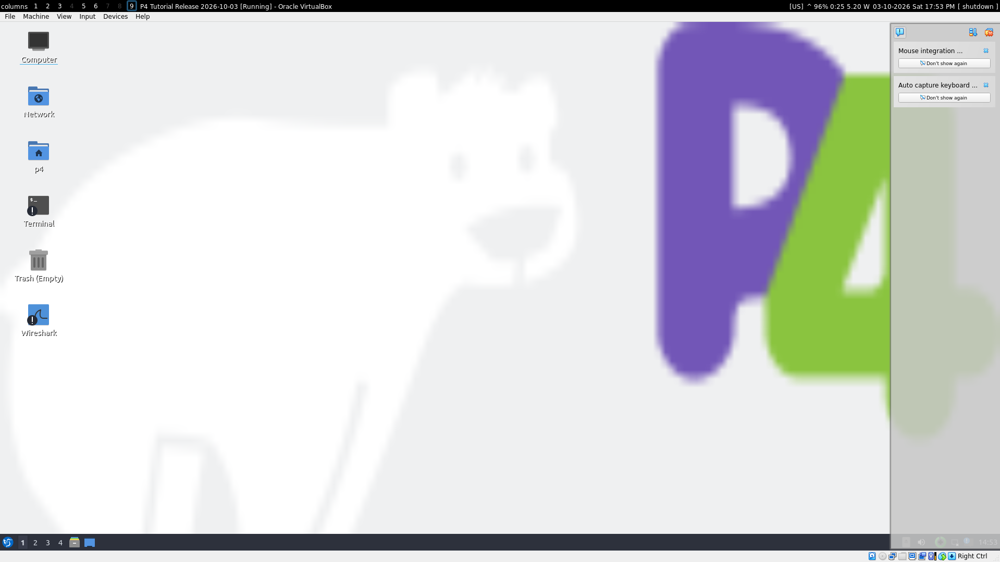
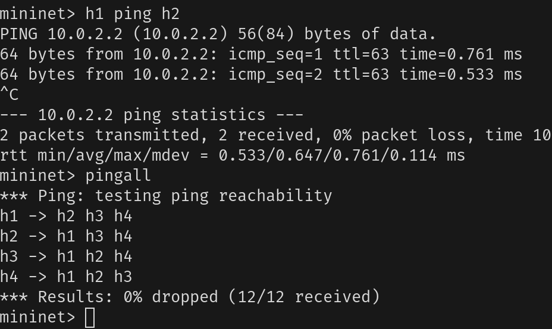
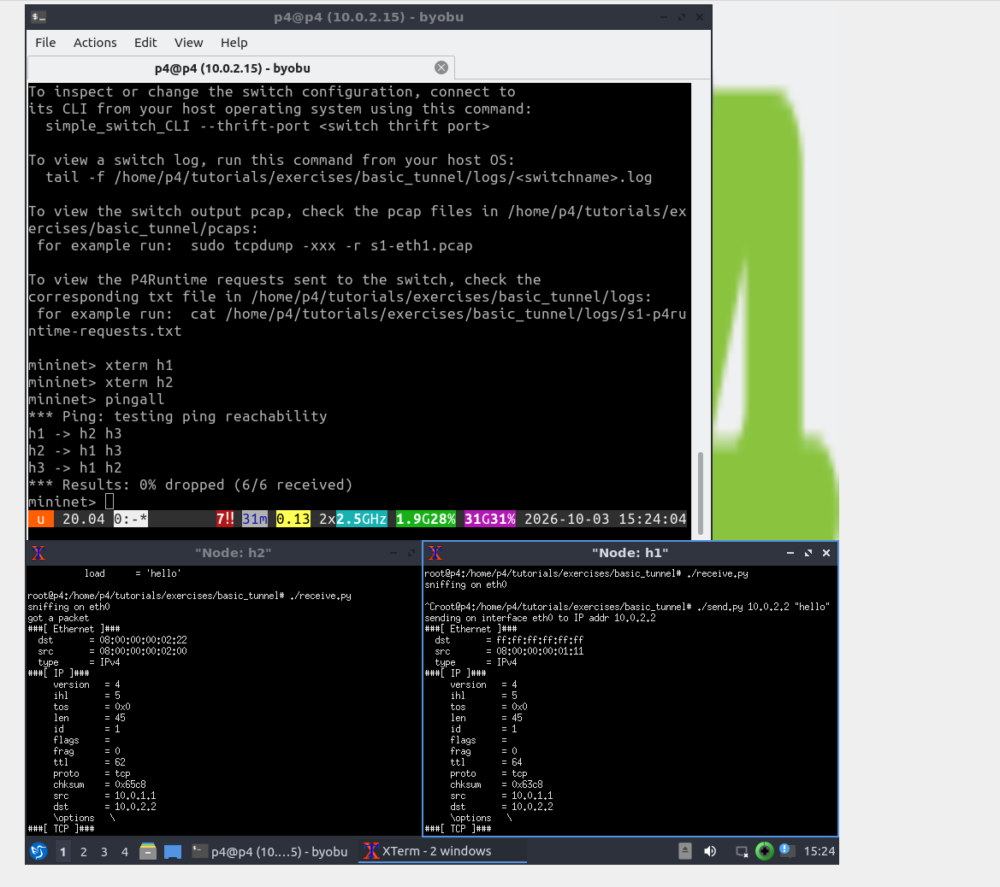

University: [ITMO University](https://itmo.ru/ru/) 
Faculty: [FICT](https://fict.itmo.ru) 
Course: [Network programming](https://github.com/itmo-ict-faculty/network-programming)  
Year: 2025/2026 
Author: Голованов Дмитрий Игоревич 
Lab: Lab4 

# Лабораторная работа №4. 

## Конфигурационные файлы

- [Базовая пересылка (basic.p4)](basic.p4)
- [Туннелирование (basic_tunnel.p4)](basic_tunnel.p4)

Ужас, просто ужас

Я поднимал все через vpn, vagrant, virtualbox

Надо руками фиксить makefile в `util`, редача там имя файла. И потом еще в обоих тасках рантаймы. 

Поднятая виртуалка:

Первое задание, пинг:

Второе, send + recieve 

